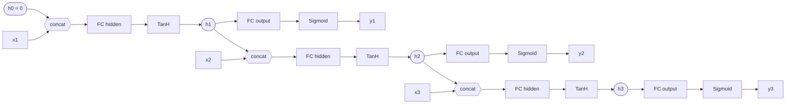

# Regularization & Recurrent Layers

Regularization constraints, Dropout, Batch Normalization and an Elman RNN cell — added to a deep learning framework written from scratch in NumPy, with no autograd and no deep learning libraries.


There is no autograd here. Every backward pass is written out explicitly as NumPy: backpropagation through time, the batch normalization gradient, the dropout mask and the regularizer sub-gradients.

---

## Part of a series

Four repositories, built in order, that together form one NumPy deep learning framework. Each stage builds directly on the previous one.

1. [PatternGenDataHandler](https://github.com/husseinsaeid85-hue/PatternGenDataHandler) — pattern generation and an image batch loader with augmentation.
2. [FullyConnectedNeuralNetwork](https://github.com/husseinsaeid85-hue/FullyConnectedNeuralNetwork) — the base framework: `BaseLayer`, fully connected layers, ReLU, SoftMax, cross-entropy, SGD.
3. [NeuralNetFramework-CNN](https://github.com/husseinsaeid85-hue/NeuralNetFramework-CNN) — convolution and pooling layers, initialization schemes, Adam and momentum.
4. **Regularization-RecurrentNN — this repository (capstone).** Regularization constraints, Dropout, Batch Normalization, and recurrent layers.

Because each stage extends the last, this repository ships the modules it **adds or changes**. The shared pieces it builds on — `Initializers.py`, the loss layers, `ReLU`, `SoftMax`, `Flatten`, `Conv`, `Pooling` — live in repositories 2 and 3 and are dropped alongside these files to assemble the full framework.

---

## The train/test phase refactor

Dropout and Batch Normalization are the first layers in the series that behave *differently* at training time and at inference time. That forced a change to the framework's core contract.

- `BaseLayer` gained a `testing_phase` boolean, defaulting to `False`.
- `NeuralNetwork` gained a `phase` property. Assigning to it propagates the phase down to every layer in the stack, so a single assignment switches the whole network.
- `NeuralNetwork.train()` sets `phase = 'train'` and `NeuralNetwork.test()` sets `phase = 'test'`, so callers never touch layer state directly.
- `Optimizers.py` was restructured around a base `Optimizer` class. It holds the optional regularizer and exposes `add_regularizer()`; `Sgd`, `SgdWithMomentum` and `Adam` all inherit from it and consult `self.regularizer` inside `calculate_update`.

```python
net.phase = 'test'   # every layer's testing_phase flips to True
```

---

## Regularization constraints

`Optimization/Constraints.py` implements two weight penalties. Both expose the same pair of methods, so an optimizer can use either interchangeably:

- `calculate_gradient(weights)` — the sub-gradient of the penalty. The optimizer subtracts this from the weights as a shrinkage step, *before* applying the data gradient.
- `norm(weights)` — the scalar penalty itself, the term that is added to the data loss to form the total loss. `RNN.calculate_regularization_loss()` uses it to aggregate the penalty over both of the layer's weight matrices.

Attaching a constraint is a single call, and it then applies to every weight that optimizer updates:

```python
optimizer = Optimizers.Adam(lr=1e-3, mu=0.9, rho=0.999)
optimizer.add_regularizer(Constraints.L2_Regularizer(4e-4))
```

---

## Comparison of the techniques

| Technique | Class | Acts on | Active during | Effect |
|---|---|---|---|---|
| L2 / ridge | `L2_Regularizer(alpha)` | weights, via the optimizer | weight updates | Shrinks each weight in proportion to its own size — keeps weights small and spread out |
| L1 / lasso | `L1_Regularizer(alpha)` | weights, via the optimizer | weight updates | Shrinks each weight by a constant amount — drives small weights to exactly zero, giving sparsity |
| Dropout | `Dropout(probability)` | activations | training only | Randomly zeroes units so no unit can rely on any other, reducing co-adaptation |
| Batch Normalization | `BatchNormalization(channel)` | activations | both, differently | Normalizes per channel, then rescales with learned gamma/beta — stabilizes and accelerates training |

L1 and L2 are properties of the *optimizer*; Dropout and Batch Normalization are *layers* you insert into the stack.

---

## Dropout

`Layers/Dropout.py` implements **inverted** dropout. The constructor takes `probability`, the fraction of units to **keep**.

- During training a fresh uniform random mask is drawn per batch, units falling outside `probability` are zeroed, and the survivors are rescaled by `1 / probability`.
- Because the scaling happens during training, the expected activation is unchanged and the testing phase reduces to a plain identity mapping — no rescaling at inference.
- `backward` reuses the stored mask, so the error only flows back through the units that survived the forward pass.

---

## Batch Normalization

`Layers/BatchNormalization.py` takes `channel`, the number of channels in the input.

- `initialize` sets gamma to ones and beta to zeros, so the layer starts as an identity transform and does not distort the signal before it has learned anything.
- **Training** uses the current batch's mean and variance, and accumulates a moving average of both.
- **Testing** substitutes that moving average, so a prediction never depends on the other samples that happen to share its batch. The moving average is seeded from the first training batch rather than from zero.
- `reformat(tensor)` folds image-like `[b, c, x, y]` input down to vector-like `[b * x * y, c]` and back again. This is what lets one implementation serve both convolutional and fully connected stacks: the same per-channel statistics apply at every spatial position.
- The input gradient is computed by `Helpers.compute_bn_gradients`, which accounts for the fact that the mean and variance are themselves functions of the input.

---

## Recurrent layers

`Layers/RNN.py` implements an Elman RNN cell. The constructor takes `input_size`, `hidden_size` and `output_size`; the hidden state starts as zeros.

The cell is assembled from two `FullyConnected` layers and the two new activations, `TanH` and `Sigmoid` (`Layers/TanH.py`, `Layers/Sigmoid.py`). Both activations cache their own output, because the derivative of each is a function of the output alone — `1 - tanh²(x)` and `σ(x)(1 - σ(x))`. That cache is what the backward pass replays, one time step at a time.

Rows of the input tensor are the time axis. Per step, the previous hidden state is concatenated with the current input and pushed through the hidden layer plus tanh; the resulting hidden state feeds both the output projection and the next time step.



The two `FC` blocks are the **same** two weight matrices at every step — the diagram is one cell drawn three times, not three cells. That sharing is the whole reason the backward pass has to run backwards through time: `backward` walks from the last step to the first, restores each step's cached activations and inputs, and **accumulates** the weight gradients across all steps before handing them to the optimizer once.

The `memorize` property decides what happens between calls. With `memorize = False` the hidden state resets to zeros at the start of every `forward`, treating each batch as an independent sequence; with `memorize = True` it carries over, so consecutive batches read as one long sequence.

---

## Structure

```
Regularization-RecurrentNN/
├── Layers/
│   ├── __init__.py
│   ├── Base.py                   # BaseLayer: trainable, weights, testing_phase
│   ├── BatchNormalization.py     # per-channel normalization + moving average
│   ├── Dropout.py                # inverted dropout
│   ├── FullyConnected.py         # affine layer, bias folded into the weights
│   ├── Helpers.py                # gradient checks, BN gradients, toy datasets
│   ├── RNN.py                    # Elman cell + backpropagation through time
│   ├── Sigmoid.py                # activation for the output projection
│   └── TanH.py                   # activation for the hidden state
├── Optimization/
│   ├── __init__.py
│   ├── Constraints.py            # L1_Regularizer, L2_Regularizer
│   └── Optimizers.py             # Optimizer base + Sgd, SgdWithMomentum, Adam
├── NeuralNetwork.py              # layer stack, phase property, train/test loop
├── requirements.txt
├── LICENSE
└── README.md
```

---

## Install

```bash
pip install -r requirements.txt
```

Only NumPy is needed for the layers, optimizers and constraints themselves. `Layers/Helpers.py` additionally pulls in matplotlib and scikit-learn for its gradient checks and toy dataset loaders.

---

## Usage

Using the recurrent layer directly, with an L2-regularized optimizer:

```python
import numpy as np

from Layers.RNN import RNN
from Optimization import Constraints, Optimizers

optimizer = Optimizers.Adam(lr=1e-3, mu=0.9, rho=0.999)
optimizer.add_regularizer(Constraints.L2_Regularizer(4e-4))

rnn = RNN(input_size=13, hidden_size=7, output_size=5)
rnn.optimizer = optimizer
rnn.memorize = True                      # carry the hidden state between calls

input_tensor = np.random.rand(9, 13)     # 9 time steps
output_tensor = rnn.forward(input_tensor)        # -> [9, 5]

error_tensor = np.random.rand(9, 5)
input_gradient = rnn.backward(error_tensor)      # -> [9, 13]
```

Assembling a regularized feed-forward stack. `Initializers` and the loss layer come from [FullyConnectedNeuralNetwork](https://github.com/husseinsaeid85-hue/FullyConnectedNeuralNetwork) and [NeuralNetFramework-CNN](https://github.com/husseinsaeid85-hue/NeuralNetFramework-CNN), as described under *Part of a series*:

```python
from Layers import Helpers
from Layers.BatchNormalization import BatchNormalization
from Layers.Dropout import Dropout
from Layers.FullyConnected import FullyConnected
from NeuralNetwork import NeuralNetwork

net = NeuralNetwork(optimizer, weights_initializer, bias_initializer)
net.data_layer = Helpers.IrisData(batch_size=50)
net.loss_layer = loss_layer

net.append_layer(FullyConnected(4, 32))
net.append_layer(BatchNormalization(32))
net.append_layer(Dropout(0.7))           # keep 70% of the units while training
net.append_layer(FullyConnected(32, 3))

net.train(500)                           # phase = 'train'

test_input, test_labels = net.data_layer.get_test_set()
predictions = net.test(test_input)       # phase = 'test'
accuracy = Helpers.calculate_accuracy(predictions, test_labels)
```

`append_layer` initializes each trainable layer and hands it its **own deep copy** of the optimizer, so the per-layer moments that Adam and momentum accumulate stay separate instead of being shared across the network.

---

## License

Released under the [MIT License](LICENSE).
